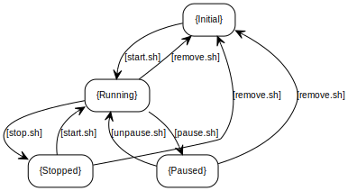

# Scripts and configuration files to build & run dockers for robots in the lab

## Quick start

### Build

`cd dockerfiles && ./build.sh [DIR]`, where DIR can be `core` or `dev`.

### Run

- `sh start.sh`: start (continue exited container or start a new container)
- `sh stop.sh`: stop (do not remove container)
- `sh remove.sh`: remove container
- `sh pause.sh`: pause the container; do not stop
- `sh unpause.sh`: unpause
- `sh into.sh`: go into the container

You can also run `./thomas_steup.sh` or put it in `~/.zshrc` (zsh is used by default). It will ask to whether start or go into docker.

---

## Details

### About docker

What is docker: [google it].
Two important concepts in using docker: image and container. For short, we first build an image, then start a container from the image.

- image: something like the ISO files with operating system.
- container: after install the OS, you can go into it and do whatever you want.

### Directory structure

- dockerfiles:
  - core
  - dev
  - ...
- scripts:
  - init.sh
- start.sh, stop.sh, remove.sh, pause.sh, unpause.sh: see bellow.
- into.sh:
- thomas_setup.sh:
- install.sh:
- functions.sh:

States illustration:

- Initial: no container
- Running: container running
- Paused: container paused; processes are paused (not killed)
- Stopped: container stopped; all processes are killed; all memory is released
